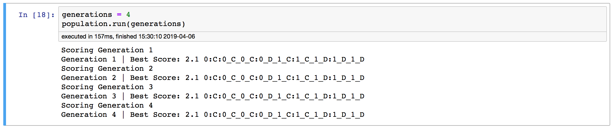

# IteratedPrisonersDilemma - GitHub
# https://github.com/tukanuk/IteratedPrisonersDilemma

This project, source code, reports and source material is available at [IteratedPrisonersDilemma](https://github.com/tukanuk/IteratedPrisonersDilemma).

## Prerequisites

- Python 3
- pip

Anyone can get started by going to [Python.org](https://www.python.org/downloads/) and downloading the latest version.

If you are on a Mac, [Homebrew](https://brew.sh) is the best way to get started. 

In Terminal;

	/usr/bin/ruby -e "$(curl -fsSL https://raw.githubusercontent.com/Homebrew/install/master/install)"
	brew install python

## Installation 

Depending on your setup, you use either `python` and `pip` **OR** `python3` and  `pip3` for the installation. On my system , that allows me to distinguish between using Python 2.x or Python 3.x. Your setup may be different.

To determine your setup, type `python --version`. If the response is `3.x.x` you can probably use `python` and `pip`.

First clone the repository into the directory of your choice: 

	cd your/directory/of/choice
	git clone https://github.com/tukanuk/IteratedPrisonersDilemma.git

A quick `ls` of the repository and you should see something like this:

	...
	-rw-r--r--   1 username  admin    1129  6 Apr 15:43 requirements.txt
	...

`requirements.txt` is a file containing all the project dependencies.

	pip3 install -r requirements.txt

The important dependencies for this project are:

	Axelrod
	Juptyer

This will install all the requirements onto your system. Depending on what you already have installed, this may take several minutes.

If that all went according to plan you should have a working copy of [Jupyter Notebook](https://jupyter.org) and the [Axelrod](https://github.com/Axelrod-Python) library. 

### Try it out

Launch Jupyter Notebook from the project directory

	jupyter notebook

Your web browser should launch and you should be greeted with a browser to allow you to open one of the `.ipynb` files.

`Iterated_Prisoners_Dilemma_Project.ipynb` is the basic notebook that has our working tournament. 

The `Iterated_Prisoners_Dilemma_Project_GA.ipynb` notebook is the work-in-progress genetic algorithm.

Yeah Genetic Algorithms!

